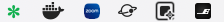
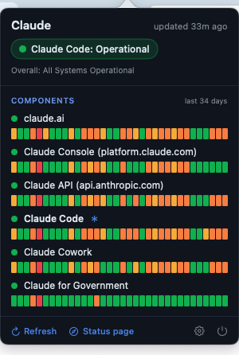
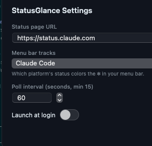

<p align="center">
  
</p>

<h1 align="center">StatusGlance</h1>

<p align="center">
  Know if Claude — or any Atlassian Statuspage service — is up, without leaving a status tab open.<br>
  A tiny native macOS menu-bar app that shows live service status as a single colored <code>✽</code>.
</p>

<p align="center">
  
  
  
  
  
</p>

<p align="center">
  
</p>

---

## Why

You keep a status page open in a browser tab "just in case." StatusGlance lets you
close it. The menu-bar glyph is **green** when your service is healthy and shifts
to **yellow → orange → red** as things degrade — so a single glance tells you
whether the problem is you or them. Click it for a compact popover that mirrors
the public status page, including a per-component history.

It ships pointed at [`status.claude.com`](https://status.claude.com), but works
with **any** site running [Atlassian Statuspage](https://www.atlassian.com/software/statuspage)
(GitHub, OpenAI, Cloudflare, Datadog, Stripe, and thousands more).

## Features

- **One-glance status.** A monochrome-free `✽` glyph tinted by live status —
  green (operational), yellow (minor), orange (major), red (critical), blue
  (maintenance), gray (can't reach the page).
- **Track exactly what you care about.** Point the glyph at the page's *overall*
  status or at a single component — for example, track **Claude Code**
  specifically and ignore the rest.
- **Per-component history.** The popover draws a status-page-style daily history
  bar for every component, reconstructed from the public incident feed.
- **Honest by design.** On a failed fetch the glyph goes gray and the popover
  says so — it never shows stale data as if it were live, and never paints days
  it has no data for as "operational."
- **Works with any Statuspage site.** Change one URL in Settings.
- **Native and lightweight.** Swift + AppKit menu-bar item with a SwiftUI
  popover. No Electron, no dependencies, no Dock icon, no background bloat.

## Screenshots

<table>
  <tr>
    <td align="center" valign="top">
      <br>
      <sub>Click the glyph: overall status, every component, and 30–90 days of history.</sub>
    </td>
    <td align="center" valign="top">
      <br>
      <sub>Pick the status page and which component drives the glyph. Auto-saves.</sub>
    </td>
  </tr>
</table>

## Install

### Build from source

Requires macOS 14+ and the Xcode 16 / Swift 6.1 toolchain.

```sh
git clone https://github.com/nateritter/status-glance.git
cd status-glance
make app            # builds a release StatusGlance.app (no Dock icon)
make install        # optional: copies it to /Applications
open StatusGlance.app
```

For development:

```sh
swift run           # build and launch straight from source
```

Other `make` targets: `build` (release binary only), `run`, `clean`, `help`.

### Keeping it up to date

Since you run a build you made yourself, there's no in-app updater — instead a
small script syncs your local build with `main`:

```sh
make update            # pull main, rebuild + relaunch only if there's something new
make install-updater   # run that check at login and every 6h via a LaunchAgent
make uninstall-updater # remove the LaunchAgent
```

`make update` is a strict no-op unless you're on a clean `main` checkout and
`origin/main` is genuinely ahead — it never disturbs in-progress work. The
LaunchAgent logs to `~/Library/Logs/StatusGlance-update.log`.

### Running an unsigned build (important)

StatusGlance is **not code-signed or notarized** — it isn't enrolled in the
Apple Developer Program. What that means in practice:

- **Building it yourself** (the steps above) produces a local app that macOS does
  **not** quarantine, so `make app` → `open StatusGlance.app` just works. No
  workaround needed. This is the recommended path.
- **A downloaded build** (e.g. a `.app`/`.zip` from someone else or a future
  Release) *will* be quarantined, and Gatekeeper will say *"StatusGlance can't be
  opened because Apple cannot check it for malicious software."* To run it
  anyway, do one of:
  - **Right-click** (Control-click) the app → **Open** → **Open** in the dialog. You
    only need to do this once.
  - Or open it once, then go to **System Settings → Privacy & Security** and click
    **Open Anyway**.
  - Or strip the quarantine flag from Terminal:

    ```sh
    xattr -dr com.apple.quarantine /Applications/StatusGlance.app
    ```

This is normal for open-source macOS apps without a paid Developer ID. If the
project later enrolls and notarizes, these steps go away.

## Configuration

Open the popover and click the gear. Settings **save automatically** and apply
when you close the window — there is no Apply button, just **Close**.

| Setting | Default | What it does |
|---|---|---|
| **Status page URL** | `https://status.claude.com` | Any Atlassian Statuspage origin. StatusGlance polls `{url}/api/v2/summary.json`; the **Test** button shows a check/✗ for reachability. |
| **Menu bar tracks** | `claude.ai` | Whether the glyph follows the page's **Overall status** or a single component (e.g. Claude Code). The tracked component is marked with `✽` in the popover. |
| **Poll interval** | `60` seconds | Minimum 15. Also polls on launch, on manual refresh, and on wake from sleep. |
| **Launch at login** | off | Registers via `SMAppService` (macOS 13+). |

## How it works

StatusGlance reads two public, unauthenticated Atlassian Statuspage v2 endpoints:

- `…/api/v2/summary.json` — current overall status and per-component status.
- `…/api/v2/incidents.json` — the recent incident feed, used to draw the
  per-component history bars (worst impact per day).

History coverage starts at the oldest incident the feed returns (clamped to 90
days) and is labeled "last N days," so the bars never imply uptime for days
outside the data window. There are no API keys, accounts, or telemetry — the app
only makes outbound GET requests to the status page you configure.

| Status | Glyph color |
|---|---|
| Operational | green |
| Minor / degraded | yellow |
| Major / partial outage | orange |
| Critical / major outage | red |
| Maintenance | blue |
| Unreachable (fetch failed) | gray |

## The glyph

The menu-bar glyph is the Unicode character `✽`
([Heavy Teardrop-Spoked Asterisk, U+273D](https://www.compart.com/en/unicode/U+273D)),
drawn entirely in code and tinted by the current status color. **This repository
bundles no image assets** — no logos, no icons, nothing trademarked — and the app
accepts no user-supplied images.

## Can't see the glyph?

If you run a **menu-bar manager** (Hidden Bar, Bartender, Ice, Dozer, …), a newly
launched app's status item often starts in the hidden section. Expand the manager
and **⌘-drag** the `✽` into the always-visible area. macOS also lets you ⌘-drag
menu-bar items to reorder them.

## Contributing

Issues and pull requests are welcome. The codebase is small and dependency-free;
`SPEC.md` documents the intended behavior end to end.

## License

[MIT](LICENSE) © 2026 Nate Ritter.

## Disclaimer

StatusGlance is an independent, unofficial project. It is **not affiliated with,
sponsored by, or endorsed by Anthropic** or any service it can be pointed at.
"Claude" and "Anthropic" are trademarks of Anthropic, PBC; all other product and
company names are the property of their respective owners. StatusGlance only
reads publicly available Atlassian Statuspage data.
